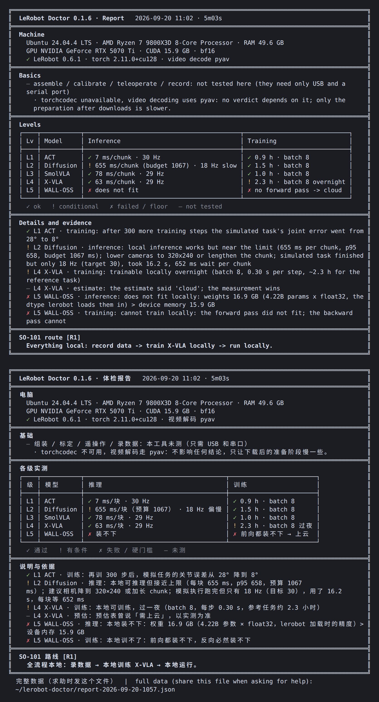

# LeRobot Doctor

[](https://www.python.org/)
[](https://github.com/huggingface/lerobot)
[](#quick-start)
[](LICENSE)

[English](README.md) · [简体中文](docs/i18n/zh/README.md)

One command that tells you whether your computer can run LeRobot 0.6.1 for an SO-101 arm, and how far: which policies it can run in real time, which it can train, and what to do in the cloud instead.

## Overview

People starting with LeRobot usually own an ordinary laptop or desktop and cannot tell in advance whether it will train an ACT policy overnight, run a vision-language-action model at 30 Hz, or do neither. `lerobot-info` prints versions, and the official hardware guide is a static table with a ±50 % error bar. LeRobot Doctor answers by doing the work for real: it builds its own environment, installs `lerobot==0.6.1`, and runs five representative policies on an official SO-101 recording, measuring inference latency, driving a 3D SO-101 in your browser for a ten-second task, and taking real training steps while stepping the batch size down until it fits.

Every verdict carries its evidence. A "cannot" is printed only after a measured failure or an arithmetic floor such as `weights 16.9 GB > VRAM 15.9 GB`. Anything that could not be tested says so, with the reason.




## Quick start

Copy one block (the copy button appears when you hover over it), paste it into a terminal, press Enter.

macOS, in Terminal:

```bash
curl -LsSf https://raw.githubusercontent.com/Yanshi-Robotics/lerobot-doctor/v0.1.4/doctor.sh | bash
```

Linux, in a terminal:

```bash
curl -LsSf https://raw.githubusercontent.com/Yanshi-Robotics/lerobot-doctor/v0.1.4/doctor.sh | bash
```

Windows 10/11, in PowerShell:

```powershell
irm https://raw.githubusercontent.com/Yanshi-Robotics/lerobot-doctor/v0.1.4/doctor.ps1 | iex
```

Prefer a download: get the ZIP of this repository, unpack it, then double-click `doctor.bat` on Windows, drag `doctor.command` into a Terminal window on macOS, or run `bash doctor.sh` on Linux.

Expect 30 to 90 minutes, most of it downloads (about 7 GB of packages and 13 GB of model weights), and about 30 GB of free disk. The screen always shows what is happening; `Ctrl-C` stops the run and keeps the finished parts. If the program itself crashes, it writes `~/lerobot-doctor/logs/crash-<time>.log`, prints the path, and on Windows waits for Enter before the window closes; open an issue with that file and the report JSON. Model weights go to the standard Hugging Face cache, so a later LeRobot course reuses them.

## Key features

- Runs on Linux, macOS (Apple Silicon and Intel) and Windows 10/11 from one pasted command; no Python setup by the user.
- Installs `lerobot==0.6.1` into a private virtual environment with `uv`; a failed install is itself a finding, with the log.
- Five levels, one representative per group of the LeRobot hardware guide, all downloadable without a Hugging Face account: ACT, Diffusion Policy, SmolVLA, X-VLA and WALL-OSS.
- Per level: timed forward passes on `lerobot/svla_so101_pickplace`, a ten-second simulated task on a kinematic SO-101 (viser, `127.0.0.1:4604`), then real training steps with `lerobot`'s own optimizer and update function.
- A fixed rule tree turns measurements into per-level verdicts and one SO-101 route: everything local, cloud training with local inference, or record-only.
- Bilingual (Chinese and English) terminal output, progress every few seconds, and a machine-readable report at `~/lerobot-doctor/report-<date>.json`.

## What it checks

1. Specs: OS, CPU, RAM, free disk, GPU, driver, `ffmpeg`. Only three floors stop the run here: free disk below 30 GB, RAM below 8 GB, Windows older than 10. An old NVIDIA driver or an Intel Mac does not stop anything; the run continues on the CPU and says so.
2. Install: `uv pip install "lerobot[...]==0.6.1"` with the CUDA build when the driver allows it, the MPS build on Apple Silicon, CPU otherwise.
3. Inference ladder, smallest first:

| Level | Policy | Group | Weights |
|---|---|---|---|
| L1 | ACT | Light BC | built from scratch (ResNet-18 ImageNet weights) |
| L2 | Diffusion Policy | Diffusion | built from scratch |
| L3 | SmolVLA | Small VLA | `lerobot/smolvla_base` |
| L4 | X-VLA | Large VLA | `lerobot/xvla-base` |
| L5 | WALL-OSS | Large VLA | `x-square-robot/wall-oss-flow` |

   A level is skipped without trying only when its weights cannot fit the device memory or a smaller level already ran out of memory. Being slow, timing out or failing to download never skips the next level.
4. Training ladder, same order, only for levels whose forward pass fit. Batch sizes step down on out-of-memory. Step time is projected onto a reference task (50 episodes × 30 s × 30 fps, 5 epochs) and reported in hours.
5. Verdicts. Inference: real-time, marginal, too slow, does not fit. Training: local, overnight, too slow (cloud), does not fit (cloud). Route: the highest level that runs locally decides between all-local, cloud training with local inference, and record-only.

ACT then trains for up to 300 extra steps (capped at five minutes) and drives the simulated arm a second time, so the page shows a policy this machine trained itself.

## Development

```bash
python tests/test_doctor.py          # rule tree, ladder state machine, parsers; no network, no torch
python lerobot_doctor.py --specs-only
python docs/check_readme.py
```

`lerobot_doctor.py` is the only program file; the four launchers only install `uv` and Python 3.12. Every threshold is a named constant with its source in a comment. Useful switches: `--device cpu`, `--vram-cap 8` (pretend a smaller GPU), `--no-sim`, `--port`, `--skip-install`, `--uninstall`. Example reports from real machines: [`examples/linux-ubuntu24-rtx5070ti-16gb.json`](examples/linux-ubuntu24-rtx5070ti-16gb.json) and [`examples/linux-ubuntu24-cpu-only-9800x3d.json`](examples/linux-ubuntu24-cpu-only-9800x3d.json).

Set `HF_ENDPOINT` to a Hugging Face mirror if downloads are slow where you are. The pi0 family is not part of the ladder because its tokenizer comes from a gated Google repository that requires an account and a license click.

## License

MIT. Sample data is the [`lerobot/svla_so101_pickplace`](https://huggingface.co/datasets/lerobot/svla_so101_pickplace) dataset; the SO-101 model comes from [SO-ARM100](https://github.com/TheRobotStudio/SO-ARM100).
