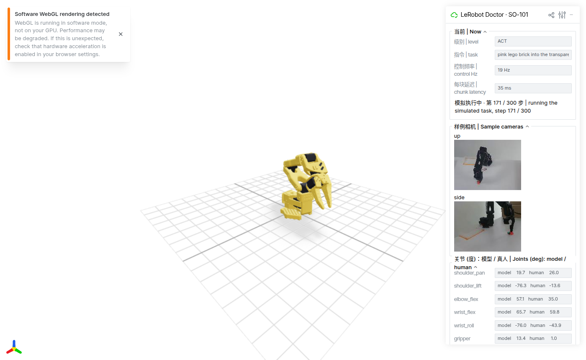

# LeRobot Doctor

[](https://www.python.org/)
[](https://github.com/huggingface/lerobot)
[](#快速开始)
[](../../../LICENSE)

[English](../../../README.md) · [简体中文](README.md)

一条命令，告诉你这台电脑能不能跑 LeRobot 0.6.1 做 SO-101 机械臂的任务，以及能跑到哪一步：哪些策略能实时推理、哪些能在本地训练、哪些得上云。

## 概览

刚开始学 LeRobot 的人手里多半是一台普通的笔记本或台式机，事先没法知道它能不能过一夜训出一个 ACT、能不能以 30 Hz 跑一个视觉语言动作模型，还是两样都不行。`lerobot-info` 只打印版本号，官方硬件指南是一张误差 ±50 % 的静态表。LeRobot Doctor 的回答方式是真的去做：它自己建环境、装 `lerobot==0.6.1`，然后在一段官方 SO-101 录像上跑五个有代表性的策略——量前向延迟，在浏览器里驱动一条 SO-101 三维模型执行十秒任务，再真的训几步，batch 从大往小试直到装得下。

每条结论都带证据。只有实测失败，或者一条能算出来的硬门槛（例如「权重 16.9 GB > 显存 15.9 GB」），才会打出「不能」。测不了的一律写「未测」和原因。



## 快速开始

复制一整块（鼠标移上去右上角有复制按钮），粘进终端，回车。

macOS，在「终端」里：

```bash
curl -LsSf https://raw.githubusercontent.com/Yanshi-Robotics/lerobot-doctor/v0.1.3/doctor.sh | bash
```

Linux，在终端里：

```bash
curl -LsSf https://raw.githubusercontent.com/Yanshi-Robotics/lerobot-doctor/v0.1.3/doctor.sh | bash
```

Windows 10/11，在 PowerShell 里：

```powershell
irm https://raw.githubusercontent.com/Yanshi-Robotics/lerobot-doctor/v0.1.3/doctor.ps1 | iex
```

想下载文件：下载本仓库的 ZIP 并解压，Windows 双击 `doctor.bat`，macOS 把 `doctor.command` 拖进终端窗口，Linux 运行 `bash doctor.sh`。

预计 30 到 90 分钟，大部分是下载（约 7 GB 的包和 13 GB 的模型权重），需要约 30 GB 空闲磁盘。屏幕上一直显示正在做什么；`Ctrl-C` 停止并保留已完成的部分。模型权重放在标准的 Hugging Face 缓存里，之后学 LeRobot 课程时直接复用。

## 主要能力

- Linux、macOS（Apple Silicon 与 Intel）、Windows 10/11 都是粘一行命令；用户不用自己配 Python。
- 用 `uv` 在独立虚拟环境里安装 `lerobot==0.6.1`；装不上本身就是一条结论，附日志。
- 五个级别，对应 LeRobot 硬件指南的五个组各取一个代表，全部不需要 Hugging Face 账号就能下载：ACT、Diffusion Policy、SmolVLA、X-VLA、WALL-OSS。
- 每级：在 `lerobot/svla_so101_pickplace` 上计时前向，在运动学 SO-101（viser，`127.0.0.1:4604`）上执行十秒模拟任务，再用 `lerobot` 自己的优化器和更新函数真训几步。
- 写死的规则树把测量值变成每级结论和一条 SO-101 路线：全流程本地、上云训练本地推理、或只能录数据。
- 中英双语终端输出，每隔几秒就有进度，机器可读的报告落在 `~/lerobot-doctor/report-<日期>.json`。

## 它检查什么

1. 规格：系统、CPU、内存、空闲磁盘、显卡、驱动、`ffmpeg`。只有三条门槛会在这里停下：空闲磁盘不到 30 GB、内存不到 8 GB、Windows 低于 10。NVIDIA 驱动太旧或 Intel Mac 都不会停，改在 CPU 上继续并如实说明。
2. 安装：`uv pip install "lerobot[...]==0.6.1"`，驱动允许时装 CUDA 版，Apple Silicon 装 MPS 版，其余装 CPU 版。
3. 推理阶梯，从小到大：

| 级别 | 策略 | 组 | 权重 |
|---|---|---|---|
| L1 | ACT | Light BC | 从零构建（ResNet-18 ImageNet 权重） |
| L2 | Diffusion Policy | Diffusion | 从零构建 |
| L3 | SmolVLA | Small VLA | `lerobot/smolvla_base` |
| L4 | X-VLA | Large VLA | `lerobot/xvla-base` |
| L5 | WALL-OSS | Large VLA | `x-square-robot/wall-oss-flow` |

   只有两种情况会不试就跳过一级：权重放不进设备内存，或更小的一级已经内存不足。慢、超时、下载失败都不会跳过下一级。
4. 训练阶梯，同样顺序，只测前向能装下的级别。内存不足时 batch 逐级减小。每步耗时投影到参考任务（50 集 × 30 秒 × 30 fps，5 个 epoch），以小时报出。
5. 结论。推理：实时、接近上限、太慢、装不下。训练：本地、过一夜、太慢（上云）、装不下（上云）。路线：由本地能跑的最高级别决定是全本地、上云训练本地推理，还是只能录数据。

ACT 会再多训最多 300 步（封顶五分钟），然后再驱动一次模拟臂，页面上看到的是这台机器自己训出来的策略。

## 开发

```bash
python tests/test_doctor.py          # 规则树、阶梯状态机、解析器；不联网、不用 torch
python lerobot_doctor.py --specs-only
python docs/check_readme.py
```

`lerobot_doctor.py` 是唯一的程序文件；四个启动器只负责装 `uv` 和 Python 3.12。所有阈值都是带来源注释的具名常量。常用开关：`--device cpu`、`--vram-cap 8`（模拟更小的显卡）、`--no-sim`、`--port`、`--skip-install`、`--uninstall`。真实机器的示例报告：[`examples/linux-ubuntu24-rtx5070ti-16gb.json`](../../../examples/linux-ubuntu24-rtx5070ti-16gb.json) 与 [`examples/linux-ubuntu24-cpu-only-9800x3d.json`](../../../examples/linux-ubuntu24-cpu-only-9800x3d.json)。

所在地区下载慢时，把 `HF_ENDPOINT` 指向一个 Hugging Face 镜像。π0 系列不在阶梯里，因为它的 tokenizer 来自 Google 的一个受限仓库，需要账号并点同意许可。

## 许可证

MIT。样例数据是 [`lerobot/svla_so101_pickplace`](https://huggingface.co/datasets/lerobot/svla_so101_pickplace) 数据集；SO-101 模型来自 [SO-ARM100](https://github.com/TheRobotStudio/SO-ARM100)。
